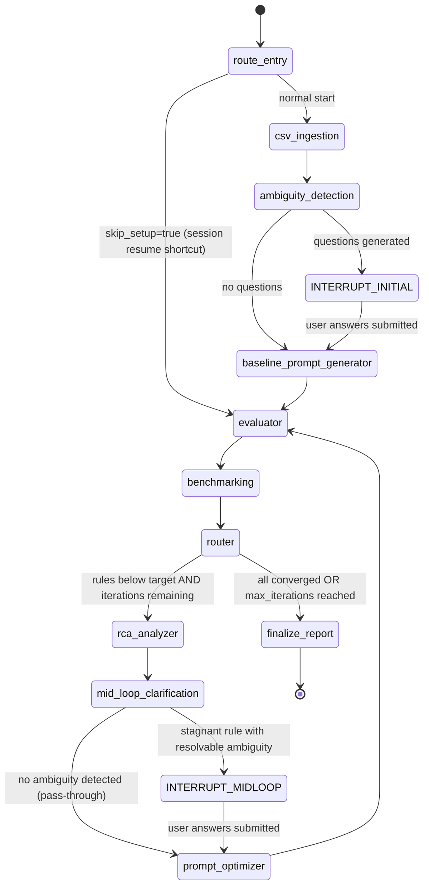

# AutoQA Prompt Optimizer — Architecture & Data Flow

---

## System Overview

The AutoQA Prompt Optimizer is a **LangGraph agentic pipeline** wrapped in a FastAPI backend with an Angular frontend. It takes CSV-formatted conversation data and iteratively refines LLM evaluation rule descriptions until each rule achieves a configurable accuracy target against ground truth labels. 

```
┌─────────────────────────────────────────────────────────────────────┐
│                         Angular Frontend                             │
│   Upload CSV → Enter Descriptions → Answer Questions → View Report  │
└───────────────────────────────┬─────────────────────────────────────┘
                                │ HTTP / SSE
                                ▼
┌─────────────────────────────────────────────────────────────────────┐
│                         FastAPI Backend                              │
│                                                                      │
│   POST /sessions          POST /sessions/{id}/descriptions           │
│   POST /sessions/{id}/answers     GET /sessions/{id}/report         │
│                                                                      │
│   In-memory session store (session_id → state snapshot)             │
└───────────────────────────────┬─────────────────────────────────────┘
                                │ asyncio.create_task
                                ▼
┌─────────────────────────────────────────────────────────────────────┐
│                     LangGraph Agent Graph                            │
│                                                                      │
│  csv_ingestion → ambiguity_detection → baseline_prompt_generator    │
│       ↓ (interrupt if questions)                                     │
│  [user answers via API resume]                                       │
│       ↓                                                              │
│  evaluator → benchmarking → router                                   │
│       ↓ (below target)              ↓ (all converged or max_iter)    │
│  rca_analyzer → mid_loop_clarification → prompt_optimizer  finalize  │
│       ↓ (interrupt if stagnant+ambiguous)                            │
│  [user answers via API resume]                                       │
│       └──────────────── loop back to evaluator ────────────────┘    │
└─────────────────────────────────────────────────────────────────────┘
                                │
                                ▼
                    OpenAI API (ChatOpenAI)
                    gpt-4o (or env-configured model)
```

---

## Agent Graph (LangGraph StateGraph)

### Node Descriptions

| Node | Phase label | Purpose |
|---|---|---|
| `csv_ingestion` | `ingesting` | Initialises `parameter_records` from parsed rules; validates state |
| `ambiguity_detection` | `awaiting_clarification` | Sends each description to an LLM classifier; generates ≤2 targeted questions per ambiguous rule; calls `interrupt()` to pause the graph for initial pre-loop clarification |
| `baseline_prompt_generator` | `generating_baselines` | Normalises every rule description to structured format before the first evaluation. Three modes: **generate** (no description), **rewrite** (clarification answers exist), **format** (plain text → structured without changing criteria). Already-structured descriptions are left unchanged. |
| `evaluator` | `evaluating` | Sends ONE LLM call per conversation containing all **non-converged** rule descriptions; converged rules are excluded to prevent LLM non-determinism from regressing rules already at target. Parses the JSON response array into per-rule predictions. |
| `benchmarking` | `benchmarking` | Computes accuracy / precision / recall / F1 per rule against original ground truth (Yes/No/NA). Dynamic metrics: predictions already combined by evaluator; no separate trigger gating needed. Applies regression guard (reverts description(s) if worse than best); marks rules `converged` or `optimizing` |
| `router` (conditional edge) | — | Routes to `finalize` if all rules converged or `max_iterations` reached; otherwise routes to `rca_analyzer` |
| `rca_analyzer` | `analyzing_failures` | Collects FP/FN cases with full transcripts; calls LLM to identify root cause in the description; stores findings in `parameter_records` |
| `mid_loop_clarification` | `awaiting_clarification` | After RCA, checks each stagnant below-target rule for description ambiguity a domain expert could resolve. Calls `interrupt()` only when: (1) the rule is stagnant (≥3 consecutive identical accuracy values), (2) RCA indicates genuine description ambiguity, and (3) the rule has not been mid-loop clarified before. Pass-through (`return {}`) otherwise — no interrupt, no delay. |
| `prompt_optimizer` | `optimizing_prompts` | Reads RCA findings + accuracy trajectory + all clarification answers (initial + mid-loop); detects stagnation (4+ identical accuracy history entries); calls LLM to rewrite description; increments iteration counter |
| `finalize` | `complete` | Assembles the structured final report with per-rule metrics, status, trajectory, optimization notes, and regression warnings (flagged when a rule's best-ever accuracy exceeded target but final accuracy did not) |

### Graph Topology



---

## Data Flow

### 1. CSV Ingestion

```
CSV file (bytes)
    │
    ▼
csv_parser.parse()
    │  validates columns, rule_type, evaluation_type, speaker, ground_truth
    │  parses transcript JSON arrays
    │  deduplicates conversations
    │  excludes rules with <5 evaluable rows
    │
    ├──▶ conversations[]       {conversation_id, transcript[]}
    ├──▶ rules[]               {rule_id, rule_type, speaker, eval_type, n_messages, description}
    ├──▶ ground_truth_map{}    {conv_id: {rule_id: "Yes"|"No"|"NA"}}
    └──▶ excluded_rules[]      rule_ids with insufficient data
```

### 2. State Object (LangGraph)

The entire optimization state is a typed `TypedDict` (`OptimizationState`) threaded through every node. Key fields:

```
OptimizationState {
  session_id               string
  conversations[]          {conversation_id, transcript[]}
  rules[]                  {rule_id, rule_type, speaker, …, description}
  ground_truth_map{}       {conv_id: {rule_id: gt_label}}
  parameter_records{}      {rule_id: ParameterRecord}    ← primary mutable state
  clarifying_questions[]   [{rule_id, question, answer_key}]
  user_answers{}           {answer_key: answer_text}
  current_iteration        int
  max_iterations           int
  accuracy_target          float
  parameters_meeting_target[]
  parameters_below_target[]
  optimization_complete    bool
  final_report             FinalReport | None
}
```

### 3. ParameterRecord (per-rule mutable state)

```
ParameterRecord {
  rule_id                  string
  rule_type                "trigger" | "answer" | "dynamic"
  speaker                  "agent" | "customer"
  trigger_speaker          "agent" | "customer" | None   ← dynamic metrics only
  trigger_description      string | None                 ← dynamic metrics: trigger condition wording
  evaluation_type          "entire" | "first" | "last"
  n_messages               int
  current_description      string       ← answer description (the field being optimized)
  current_predictions{}    {conv_id: "Yes"|"No"|"NA"}   ← combined for dynamic, binary for others
  current_rationales{}     {conv_id: string}             ← evaluator's stated reasoning per conversation; truncated to 500 chars
  current_accuracy         float
  current_precision        float
  current_recall           float
  current_f1               float
  true_positives           int
  false_positives          int
  true_negatives           int
  false_negatives          int
  not_applicable_count     int
  initial_accuracy         float
  best_accuracy            float        ← regression guard anchor
  best_description         string       ← reverted to on regression
  best_trigger_description string | None  ← dynamic: trigger description at best accuracy
  iteration_history[]      [{iteration, description, trigger_description?, accuracy, precision, recall, f1}]
  rca_findings             string
  status                   "pending" | "optimizing" | "converged" | "max_iterations_reached"
  optimization_notes       string
}
```

### 4. Evaluator Data Flow

```
Per iteration, for each conversation:

conversation.transcript + rules[].current_description
    │
    │  Dynamic metrics (rule_type="dynamic") are expanded inline:
    │    metric_name  →  {id: "metric_name__trigger", description: trigger_description}
    │                    {id: "metric_name__answer",  description: current_description}
    │
    ▼
System prompt (fixed evaluation engine — never modified)
+ Human message: conversation transcript + all rule objects as JSON array
    │
    ▼
LLM (one call per conversation, all rules in one request)
    │
    ▼
JSON response array: [{_id, isQualified, rationale}]
    │
    │  Dynamic metrics: combine trigger+answer results
    │    trigger=false  →  combined = "NA"  (scenario absent)
    │    trigger=true, answer=true  →  combined = "Yes"
    │    trigger=true, answer=false →  combined = "No"
    │
    ▼
parameter_records[rule_id].current_predictions[conv_id] = "Yes" | "No" | "NA"
```

### 5. Benchmarking Logic

```
For each non-converged rule:

1. Compute metrics from current_predictions vs ground_truth_map
   Dynamic metrics: predictions already Yes/No/NA (combined by evaluator); no gating needed.
   Static rules: predictions are Yes/No; NA comes from ground truth only.
   (NA ground truths excluded from denominator)

2. Regression guard:
   if new_accuracy < best_accuracy → revert current_description to best_description
                                     (dynamic: also revert trigger_description to best_trigger_description)
   else → update best_accuracy and best_description (+ best_trigger_description for dynamic)

3. Convergence check:
   if new_accuracy >= accuracy_target → status = "converged" (locked forever)
   else → status = "optimizing" → route to RCA

4. Append to iteration_history
```

### 6. RCA → Optimizer Data Flow

```
Error cases (FP + FN predictions):

    ground_truth_map + current_predictions
        │
        ▼
    collect up to 10 misclassified conversations
    with full transcript (up to 12 messages each)
    and evaluator rationale for each misclassification
        │
        ▼
    RCA LLM prompt:
      - current_description
      - accuracy trajectory (per-iteration history)
      - error classification labels (FP / FN definitions)
      - error cases with full transcripts and evaluator rationales
        (the evaluator's stated reasoning is treated as evidence of
         how the description was interpreted; RCA LLM is instructed
         to cross-check rationales against the transcript rather
         than accepting them as confirmed causes)
        │
        ▼
    rca_findings (3-5 sentence root cause)
        │
        ▼
    Optimizer LLM prompt:
      - current_description
      - rca_findings
      - accuracy trajectory
      - user_answers (clarification Q&A)
      - stagnation flag → "radical pivot" instruction if 4+ identical accuracy entries
        │
        ▼
    new current_description (structured format)
```

---

## API Sequence Diagram

```
Frontend                  FastAPI                  LangGraph Graph
   │                         │                          │
   │── POST /sessions ──────▶│                          │
   │   (file upload)         │── csv_parser.parse() ──▶│
   │                         │◀── session_id, rules ───│
   │◀── session_id ──────────│                          │
   │                         │                          │
   │── POST /sessions/{id}   │                          │
   │   /descriptions ───────▶│                          │
   │                         │── asyncio.create_task ──▶│
   │                         │   (graph.ainvoke)         │── ingestion
   │◀── {status: started} ───│                           │── baseline_generator
   │                         │                           │── ambiguity_detection
   │── GET /sessions/{id} ──▶│                           │    └── interrupt()
   │   (polling) ────────────│◀── phase=awaiting_clarif─┤
   │◀── questions[] ─────────│                          │
   │                         │                          │
   │── POST /sessions/{id}   │                          │
   │   /answers ────────────▶│                          │
   │                         │── graph.ainvoke(         │
   │                         │   Command(resume=...)) ──▶│── evaluator
   │◀── {status: resumed} ───│                          │── benchmarking
   │                         │                          │── router
   │── GET /sessions/{id} ──▶│                          │── rca_analyzer
   │   (polling) ────────────│                          │── mid_loop_clarification
   │◀── phase=evaluating ────│                          │   (may interrupt if stagnant+ambiguous)
   │                         │                          │
   │  [if mid-loop interrupt]│                          │
   │── GET /sessions/{id} ──▶│                          │
   │◀── questions[] ─────────│◀── phase=awaiting_clarif─┤
   │── POST /sessions/{id}   │                          │
   │   /answers ────────────▶│── graph.ainvoke(         │
   │                         │   Command(resume=...)) ──▶│── prompt_optimizer
   │◀── {status: resumed} ───│                          │── evaluator (loop)
   │                         │                          │       …
   │── GET /sessions/{id}    │                          │── finalize
   │   /report ─────────────▶│                          │
   │◀── FinalReport ─────────│◀── optimization_complete─┤
   │                         │                          │
```

---

## Session & Concurrency Model

- Each session is a **separate LangGraph thread** identified by `session_id` (= `thread_id` in LangGraph config)
- Sessions never share state — all data is isolated within the LangGraph checkpointer
- The session store (`in-memory dict`) holds a lightweight mirror of key phase/progress fields so the `GET /sessions/{id}` polling endpoint can respond without reading the full LangGraph state
- The graph runs as an `asyncio` task (`asyncio.create_task`) — never in a thread pool — to avoid conflicts with async LangGraph internals
- The LangGraph `interrupt()` mechanism pauses the graph coroutine until `Command(resume=...)` is sent via the `/answers` endpoint

---

## LLM Call Budget (per session)

| Stage | LLM calls | Notes |
|---|---|---|
| Baseline generator | 0–1 per rule | Skipped if description already in structured format; otherwise 1 call (generate / rewrite / format) |
| Ambiguity detection | 1 per rule | Classifies ambiguity, generates questions; may interrupt for user answers |
| Evaluator | 1 per conversation per iteration | Non-converged rules only, all in one call per conversation |
| RCA analyzer | 1 per below-target rule per iteration | Reads FP/FN cases with transcripts |
| Mid-loop clarification | 0–1 per stagnant rule | Only when rule is stagnant ≥3 iterations AND RCA flags genuine ambiguity; pass-through otherwise |
| Prompt optimizer | 1 per below-target rule per iteration | Rewrites description using RCA + all clarification answers |

For a typical session (15 conversations, 4 rules, 5 iterations, 2 rules converge at iteration 1):

```
Baseline:    4 calls
Ambiguity:   4 calls
Iteration 1: 15 (eval) + 4 (RCA) + 4 (optimizer) = 23 calls  →  2 rules converge
Iteration 2: 15 (eval) + 2 (RCA) + 2 (optimizer) = 19 calls  →  1 more converges
Iteration 3: 15 (eval) + 1 (RCA) + 1 (optimizer) = 17 calls  →  1 more converges
Iterations 4-5: 15 + 0 + 0 = 15 calls each (all converged)

Total: ~97 calls (worst case ~150 calls for 5 full iterations, 4 rules)
```

---

## Key Design Decisions

| Decision | Rationale |
|---|---|
| One LLM call per conversation (all rules) | Batch evaluation reduces latency and token overhead vs one call per rule×conversation |
| Description-only optimization | The system prompt (evaluation engine logic) is fixed and trusted; only the `description` field inside each rule object is rewritten |
| Regression guard at benchmarking | Reverts descriptions that degrade accuracy before routing to RCA — prevents compounding errors across iterations |
| Converged rules excluded from evaluator | Prevents LLM non-determinism from regressing rules that have already hit target |
| `asyncio.create_task` not `BackgroundTasks` | FastAPI's `BackgroundTasks` runs in a thread pool; LangGraph uses async coroutines — mixing the two causes event loop conflicts |
| In-memory session store | Sufficient for the POC; avoids database dependency; sessions are short-lived (minutes to hours) |
| Stagnation detection (4 identical entries) | Prevents the optimizer from making micro-edits that never break out of a local minimum |
| Transcript-aware RCA | LLM can read the actual failed conversations rather than working from statistics alone — mirrors how a human QA analyst would diagnose misclassifications |
| Baseline format normalization | Rules with user-provided descriptions that converge immediately (never hitting the optimizer) would remain in plain-text format without this pass — the `format` mode ensures every exported prompt is in the same structured format regardless of iteration path |
| Wide-format evaluation CSV | One row per conversation (column groups per rule) is more ergonomic for analysis than long format — avoids repeated conversation_id values and makes per-conversation cross-rule comparisons directly readable |
| Client-side export (CSV + PDF) | All export logic runs in the Angular frontend from the already-loaded report JSON — no additional API endpoints or server-side rendering required |
