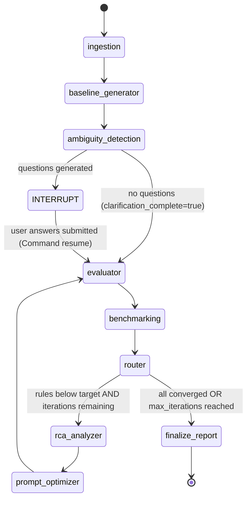

# AutoQA Prompt Optimizer — Architecture & Data Flow

---

## System Overview

The AutoQA Prompt Optimizer is a **LangGraph agentic pipeline** wrapped in a FastAPI backend with an Angular frontend. It takes CSV-formatted conversation data and iteratively refines LLM evaluation rule descriptions until each rule achieves a configurable accuracy target against ground truth labels.

```
┌─────────────────────────────────────────────────────────────────────┐
│                         Angular Frontend                             │
│   Upload CSV → Enter Descriptions → Answer Questions → View Report  │
└───────────────────────────────┬─────────────────────────────────────┘
                                │ HTTP / SSE
                                ▼
┌─────────────────────────────────────────────────────────────────────┐
│                         FastAPI Backend                              │
│                                                                      │
│   POST /sessions          POST /sessions/{id}/descriptions           │
│   POST /sessions/{id}/answers     GET /sessions/{id}/report         │
│                                                                      │
│   In-memory session store (session_id → state snapshot)             │
└───────────────────────────────┬─────────────────────────────────────┘
                                │ asyncio.create_task
                                ▼
┌─────────────────────────────────────────────────────────────────────┐
│                     LangGraph Agent Graph                            │
│                                                                      │
│  ingestion → baseline_generator → ambiguity_detection               │
│       ↓ (interrupt on questions)                                     │
│  [user answers via API resume]                                       │
│       ↓                                                              │
│  evaluator → benchmarking → router                                   │
│       ↓ (below target)              ↓ (all converged or max_iter)    │
│  rca_analyzer → prompt_optimizer   finalize_report                   │
│       └────────── loop back to evaluator ──────────────┘            │
└─────────────────────────────────────────────────────────────────────┘
                                │
                                ▼
                    OpenAI API (ChatOpenAI)
                    gpt-4o (or env-configured model)
```

---

## Agent Graph (LangGraph StateGraph)

### Node Descriptions

| Node | Phase label | Purpose |
|---|---|---|
| `ingestion` | `ingesting` | Initialises `parameter_records` from parsed rules; validates state |
| `baseline_generator` | `generating_baseline` | Rewrites each rule description into the structured format (METRIC_NAME / SPEAKER / ACTION / PASS_LOGIC / PASS_CRITERIA / EXAMPLES) before the first evaluation |
| `ambiguity_detection` | `awaiting_clarification` | Sends each description to an LLM classifier; generates ≤2 targeted questions per ambiguous rule; calls `interrupt()` to pause the graph |
| `evaluator` | `evaluating` | Sends ONE LLM call per conversation containing ALL rule descriptions; parses the JSON response array into per-rule predictions |
| `benchmarking` | `benchmarking` | Computes accuracy / precision / recall / F1 per rule; applies regression guard (reverts description if worse than best); marks rules `converged` or `optimizing` |
| `router` | — | Conditional edge: routes to `finalize_report` if all rules converged or `max_iterations` reached; otherwise routes to `rca_analyzer` |
| `rca_analyzer` | `analyzing_failures` | Collects FP/FN cases with full transcripts; calls LLM to identify root cause in the description; stores findings in `parameter_records` |
| `prompt_optimizer` | `optimizing_prompts` | Reads RCA findings + accuracy trajectory + clarification answers; detects stagnation (4+ identical accuracy history entries); calls LLM to rewrite description; increments iteration counter |
| `finalize_report` | `complete` | Assembles the structured final report with per-rule metrics, status, trajectory, and any regression warnings |

### Graph Topology



---

## Data Flow

### 1. CSV Ingestion

```
CSV file (bytes)
    │
    ▼
csv_parser.parse()
    │  validates columns, rule_type, evaluation_type, speaker, ground_truth
    │  parses transcript JSON arrays
    │  deduplicates conversations
    │  excludes rules with <5 evaluable rows
    │
    ├──▶ conversations[]       {conversation_id, transcript[]}
    ├──▶ rules[]               {rule_id, rule_type, speaker, eval_type, n_messages, description}
    ├──▶ ground_truth_map{}    {conv_id: {rule_id: "Yes"|"No"|"NA"}}
    └──▶ excluded_rules[]      rule_ids with insufficient data
```

### 2. State Object (LangGraph)

The entire optimization state is a typed `TypedDict` (`OptimizationState`) threaded through every node. Key fields:

```
OptimizationState {
  session_id               string
  conversations[]          {conversation_id, transcript[]}
  rules[]                  {rule_id, rule_type, speaker, …, description}
  ground_truth_map{}       {conv_id: {rule_id: gt_label}}
  parameter_records{}      {rule_id: ParameterRecord}    ← primary mutable state
  clarifying_questions[]   [{rule_id, question, answer_key}]
  user_answers{}           {answer_key: answer_text}
  current_iteration        int
  max_iterations           int
  accuracy_target          float
  parameters_meeting_target[]
  parameters_below_target[]
  optimization_complete    bool
  final_report             FinalReport | None
}
```

### 3. ParameterRecord (per-rule mutable state)

```
ParameterRecord {
  rule_id                  string
  rule_type                "trigger" | "answer"
  speaker                  "agent" | "customer"
  evaluation_type          "entire" | "first" | "last"
  n_messages               int
  current_description      string       ← the only field being optimized
  current_predictions{}    {conv_id: "Yes"|"No"}
  current_accuracy         float
  current_precision        float
  current_recall           float
  current_f1               float
  true_positives           int
  false_positives          int
  true_negatives           int
  false_negatives          int
  not_applicable_count     int
  initial_accuracy         float
  best_accuracy            float        ← regression guard anchor
  best_description         string       ← reverted to on regression
  iteration_history[]      [{iteration, description, accuracy, precision, recall, f1}]
  rca_findings             string
  status                   "pending" | "optimizing" | "converged" | "max_iterations_reached"
  optimization_notes       string
}
```

### 4. Evaluator Data Flow

```
Per iteration, for each conversation:

conversation.transcript + rules[].current_description
    │
    ▼
System prompt (fixed evaluation engine — never modified)
+ Human message: conversation transcript + all rule objects as JSON array
    │
    ▼
LLM (one call per conversation, all rules in one request)
    │
    ▼
JSON response array: [{rule_id, isQualified|isAdhered, reasoning}]
    │
    ├─▶ trigger rules  →  isQualified: true/false
    └─▶ answer rules   →  isAdhered: true/false
    │
    ▼
parameter_records[rule_id].current_predictions[conv_id] = "Yes" | "No"
```

### 5. Benchmarking Logic

```
For each non-converged rule:

1. Compute metrics from current_predictions vs ground_truth_map
   (NA ground truths excluded from denominator)

2. Regression guard:
   if new_accuracy < best_accuracy → revert current_description to best_description
   else → update best_accuracy and best_description

3. Convergence check:
   if new_accuracy >= accuracy_target → status = "converged" (locked forever)
   else → status = "optimizing" → route to RCA

4. Append to iteration_history
```

### 6. RCA → Optimizer Data Flow

```
Error cases (FP + FN predictions):

    ground_truth_map + current_predictions
        │
        ▼
    collect up to 10 misclassified conversations
    with full transcript (up to 12 messages each)
        │
        ▼
    RCA LLM prompt:
      - current_description
      - accuracy trajectory (per-iteration history)
      - error classification labels (FP / FN definitions)
      - error cases with full transcripts
        │
        ▼
    rca_findings (3-5 sentence root cause)
        │
        ▼
    Optimizer LLM prompt:
      - current_description
      - rca_findings
      - accuracy trajectory
      - user_answers (clarification Q&A)
      - stagnation flag → "radical pivot" instruction if 4+ identical accuracy entries
        │
        ▼
    new current_description (structured format)
```

---

## API Sequence Diagram

```
Frontend                  FastAPI                  LangGraph Graph
   │                         │                          │
   │── POST /sessions ──────▶│                          │
   │   (file upload)         │── csv_parser.parse() ──▶│
   │                         │◀── session_id, rules ───│
   │◀── session_id ──────────│                          │
   │                         │                          │
   │── POST /sessions/{id}   │                          │
   │   /descriptions ───────▶│                          │
   │                         │── asyncio.create_task ──▶│
   │                         │   (graph.ainvoke)         │── ingestion
   │◀── {status: started} ───│                           │── baseline_generator
   │                         │                           │── ambiguity_detection
   │── GET /sessions/{id} ──▶│                           │    └── interrupt()
   │   (polling) ────────────│◀── phase=awaiting_clarif─┤
   │◀── questions[] ─────────│                          │
   │                         │                          │
   │── POST /sessions/{id}   │                          │
   │   /answers ────────────▶│                          │
   │                         │── graph.ainvoke(         │
   │                         │   Command(resume=...)) ──▶│── evaluator
   │◀── {status: resumed} ───│                          │── benchmarking
   │                         │                          │── router
   │── GET /sessions/{id} ──▶│                          │── rca_analyzer
   │   (polling) ────────────│                          │── prompt_optimizer
   │◀── phase=evaluating ────│                          │── evaluator (loop)
   │                         │                          │       …
   │── GET /sessions/{id}    │                          │── finalize_report
   │   /report ─────────────▶│                          │
   │◀── FinalReport ─────────│◀── optimization_complete─┤
   │                         │                          │
```

---

## Session & Concurrency Model

- Each session is a **separate LangGraph thread** identified by `session_id` (= `thread_id` in LangGraph config)
- Sessions never share state — all data is isolated within the LangGraph checkpointer
- The session store (`in-memory dict`) holds a lightweight mirror of key phase/progress fields so the `GET /sessions/{id}` polling endpoint can respond without reading the full LangGraph state
- The graph runs as an `asyncio` task (`asyncio.create_task`) — never in a thread pool — to avoid conflicts with async LangGraph internals
- The LangGraph `interrupt()` mechanism pauses the graph coroutine until `Command(resume=...)` is sent via the `/answers` endpoint

---

## LLM Call Budget (per session)

| Stage | LLM calls | Notes |
|---|---|---|
| Baseline generator | 1 per rule | Rewrites initial descriptions into structured format |
| Ambiguity detection | 1 per rule | Classifies ambiguity, generates questions |
| Evaluator | 1 per conversation per iteration | All rules in one call per conversation |
| RCA analyzer | 1 per below-target rule per iteration | Reads FP/FN cases with transcripts |
| Prompt optimizer | 1 per below-target rule per iteration | Rewrites description |

For a typical session (15 conversations, 4 rules, 5 iterations, 2 rules converge at iteration 1):

```
Baseline:    4 calls
Ambiguity:   4 calls
Iteration 1: 15 (eval) + 4 (RCA) + 4 (optimizer) = 23 calls  →  2 rules converge
Iteration 2: 15 (eval) + 2 (RCA) + 2 (optimizer) = 19 calls  →  1 more converges
Iteration 3: 15 (eval) + 1 (RCA) + 1 (optimizer) = 17 calls  →  1 more converges
Iterations 4-5: 15 + 0 + 0 = 15 calls each (all converged)

Total: ~97 calls (worst case ~150 calls for 5 full iterations, 4 rules)
```

---

## Key Design Decisions

| Decision | Rationale |
|---|---|
| One LLM call per conversation (all rules) | Batch evaluation reduces latency and token overhead vs one call per rule×conversation |
| Description-only optimization | The system prompt (evaluation engine logic) is fixed and trusted; only the `description` field inside each rule object is rewritten |
| Regression guard at benchmarking | Reverts descriptions that degrade accuracy before routing to RCA — prevents compounding errors across iterations |
| Converged rules excluded from evaluator | Prevents LLM non-determinism from regressing rules that have already hit target |
| `asyncio.create_task` not `BackgroundTasks` | FastAPI's `BackgroundTasks` runs in a thread pool; LangGraph uses async coroutines — mixing the two causes event loop conflicts |
| In-memory session store | Sufficient for the POC; avoids database dependency; sessions are short-lived (minutes to hours) |
| Stagnation detection (4 identical entries) | Prevents the optimizer from making micro-edits that never break out of a local minimum |
| Transcript-aware RCA | LLM can read the actual failed conversations rather than working from statistics alone — mirrors how a human QA analyst would diagnose misclassifications |
